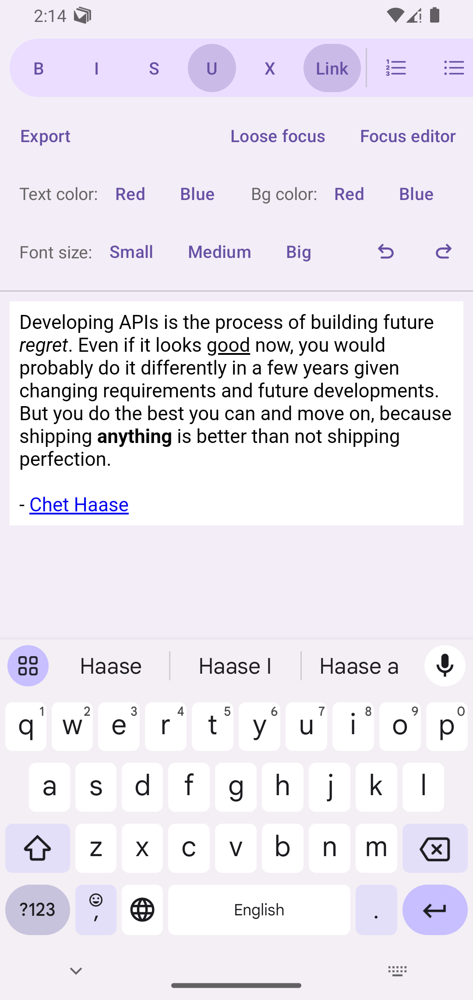
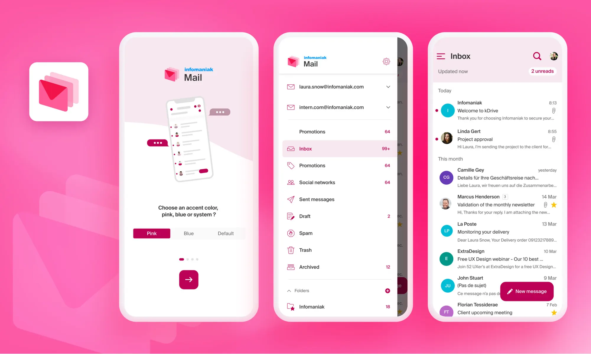

# Infomaniak Rich HTML Editor


The **Infomaniak Rich HTML Editor** is an Android library designed to display HTML and easily modify it on the fly. It relies on
the power of the `contenteditable` HTML attribute inside a WebView.




## ✍️ About

### Features

- **HTML Content Editing**: Full support for viewing and editing HTML content directly.
- **Wide range of formatting commands**: Many commands are available to format text, from simple commands like bold to more
  advanced ones like link creation.
- **Useful API to control the editor**: It lets you:
    - Listen to format option's activated status when the cursor moves around the html content
    - Add custom css to the editor
    - Add custom scripts to the editor

### Installation

Add this dependency to your project:

Using version catalog:

```toml
rich-html-editor = { module = "com.github.infomaniak:android-rich-html-editor", version.ref = "richHtmlEditorVersion" }
```

Directly inside gradle dependencies:

```gradle
dependencies {
    implementation "com.github.Infomaniak:android-rich-html-editor:$richHtmlEditorVersion"
}
```

The latest version is: 

## ⚙️ Usage

### Simplest usage

In your layout:

```xml
<com.infomaniak.lib.richhtmleditor.RichHtmlEditorWebView
        android:id="@+id/editor"
        android:layout_width="match_parent"
        android:layout_height="match_parent"/>
```

In your fragment:

```kt
val html = """
<html>
    <body>
        <h1>Hello World</h1>
    </body>
</html>
""".trimMargin()
editor.setHtml(html)
```

### Change format and reacte to its changes

Add a button to your xml:

```xml
<Button
        android:id="@+id/boldButton"
        android:text="Bold"
        android:layout_width="wrap_content"
        android:layout_height="wrap_content" />
```

Set a click listener on the button to apply the associated format and modify the appearance of the button to report the status
where the cursor is placed:

```kt
boldButton.setOnClickListener { editor.toggleBold() }

viewLifecycleOwner.lifecycleScope.launch {
    editor.editorStatusesFlow.collect {
        // Update your button's activation status how you prefer. If you have provided
        // an activated state color for your button, you can do the following:
        boldButton.isActivated = it.isBold
    }
}
```

> [!TIP]
> If you want to listen to the status changes of a format, do not forget to subscribe to it as described in the following 
> [Subscribe to format states](#subscribeToStates) section.

### <a name="subscribeToStates"></a>Subscribe to format states

You can subscribe only to the states that are relevant to you. This way, the flow will update its value only when at least one of 
your subscribed states changes.

```kt
editor.subscribeToStates(setOf(StatusCommand.BOLD, StatusCommand.ITALIC))
```

> [!NOTE]
> By default, when `subscribeToStates()` is never called, all available StatusCommand will be subscribed to.
> 
> You can subscribe to all possible states by passing in `null`
> ```kt
> editor.subscribeToStates(null)
> ```

### Add custom css or script to the editor

You can add your own css to stylize your editor to your liking or you can add scripts to develop your own advanced
functionalities. To do so, the editor exposes two easy to use methods.

```kt
editor.apply {
    addCss("div { padding: 8px }")
    addScript("document.body.style['background'] = '#00FFFF'")
}
```

### Use a custom WebViewClient with the editor

To safely use your own WebViewClient instance with the editor, you have to call the
RichHtmlEditorWebView's `notifyPageHasLoaded()` inside your custom WebViewClient's `onPageFinished()` callback.

### More advanced features

For more advanced features, take a look at the [sample project](sample) or
the [Infomaniak Mail app](https://github.com/Infomaniak/android-kMail) that uses this rich html editor.

## 📖 Documentation

Useful methods and classes inside the project are documented with KDoc.

## 🔍 Sample Projects

You can find a sample project in the [sample](sample) folder.

## 📱 Apps using the rich html editor

<a href="https://github.com/Infomaniak/android-kMail">
    
</a>

[Infomaniak Mail](https://github.com/Infomaniak/android-kMail) allows you to manage your Infomaniak addresses in a completely
secure environment.
